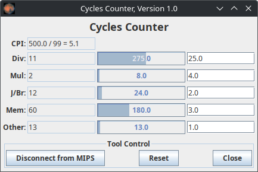

[](https://GitHub.com/Toby-Shi-cloud/Mars-with-BUAA-CO-extension/releases/)
[](https://github.com/Toby-Shi-cloud/Mars-with-BUAA-CO-extension/actions/workflows/build.yml)

## 这是什么？

基于 `Mars 4.5` 开发的魔改版，用于 BUAA 的**计算机组成（CO）**实验。核心用途：**把它当作"黄金模型"，输出 CPU 写寄存器/写内存的轨迹，与你自己的 CPU（Logisim/Verilog）对拍**；P7 还支持 **CP0 异常 / 外部中断 / Timer** 的建模，可与 P7 整机对拍。

> 绝大部分新增功能只在**命令行**使用：`java -jar Mars.jar <asm文件> [参数...]`。命令 `java -jar Mars.jar h` 可查看完整参数。参数不区分大小写。
>
> **声明：** P7 相关支持迁移自课程官方 Mars P7（参考官方 P7 版本实现）。

---

## 一、最常用：CO 对拍

把一段 `.asm` 跑成"标准答案轨迹"。最常用的命令：

```sh
# 非 P7（P4–P6）：打印寄存器/内存写、开延迟槽、干净输出
java -jar Mars.jar test.asm nc db mc CompactLargeText coL1

# P7：加 efc（异常/中断处理）；要测外部中断再加 p7irq=
java -jar Mars.jar test.asm nc db mc CompactLargeText efc coL1
java -jar Mars.jar test.asm nc db mc CompactLargeText efc coL1 p7irq=0x3100
```

`coL1` 输出格式（与课程 P4 要求一致，可直接与 testbench 的 `$display` 对拍）：

```
@00003000: $ 1 <= 00000001       # 寄存器写：@PC: $寄存器号 <= 值
@00003004: *00001004 <= 00000002 # 内存写：  @PC: *地址 <= 值
```

### 核心参数（按重要性排序）

| 参数 | 作用 |
|---|---|
| **`coL1`** | **对拍核心**：打印寄存器写 / 内存写（P4 格式）。写 `$0` 不打印 |
| **`mc <config>`** | 内存配置。课程用 **`CompactLargeText`**（text@0x3000、异常入口 0x4180、最多 4096 条指令）；P4–P6 测试数据可能非法时可用 `FixedCompactLargeText`（异常处理段放到用户数据之外，便于单独编写） |
| **`db`** | 启用 MIPS 延迟槽（**P5/P6/P7 必须**；否则跳转/分支后那条指令不会执行，与流水线 CPU 不一致，导致对拍出错） |
| **`efc`** | **启用 P7 异常/中断处理**：CP0（SR/Cause/EPC）建模、异常派发到 0x4180、按 BUAA 语义设置 EPC/BD/EXL/ExcCode、定时器与中断 |
| **`p7irq=0x..,0x..`** | **P7 外部中断调度**：当"已提交 PC"命中列表中的某地址时注入外部中断（HWInt 第 2 位），每个地址只触发一次。会自动启用 `efc`。时序见[下文](#二p7-对拍专题重点) |
| **`nc`** | 不打印版权信息（重定向/管道时更干净） |

### 其他参数

| 参数 | 作用 |
|---|---|
| `coL2` | 调试级输出：逐条打印 `@PC -> 汇编 (机器码)` 及读写，便于单步查错 |
| `coERR` | 把本扩展打印的内容输出到 `stderr`（默认 `stdout`） |
| `ig` | 忽略全部算术溢出（**对拍 P7 溢出异常时不要加**） |
| `a` | 只汇编、不仿真（配合 `dump`） |
| `dump <段> <格式> <文件>` | 导出内存段。导出机器码：`a dump .text HexText code.txt test.asm`；导出内核段：`a dump 0x00004180-0x00004ffc HexText kernel.txt test.asm` |
| `cl <class>` | 加载 `.class` 扩展指令（见[教程](#五自定义额外指令教程)） |
| `cc` / `ccw <除:乘:跳:访存:其他>` | 统计指令并估算周期 / 设置各类指令周期权重（默认 `25:4:2:3:1`，浮点可用）。**注意：是估算，并非某具体流水线的精确周期** |

---

## 二、P7 对拍专题（重点）

`efc` 在原版基础上新增 P7 所需的异常与中断处理：

- **CP0 与异常**：`SR`（IM=bit15:10、EXL=bit1、IE=bit0）、`Cause`（BD=bit31、IP=bit15:10、ExcCode=bit6:2）、`EPC`；异常码 `Int=0, AdEL=4, AdES=5, Syscall=8, RI=10, Ov=12`。异常时设 ExcCode、`EXL←1`、`EPC←`故障 PC（延迟槽则置 BD 且 EPC←PC-4），派发到 **0x4180**；`eret` 恢复 PC=EPC 并清 EXL。支持 PC 未对齐/取指异常检测。这些与标准 BUAA CP0 逐位一致。
- **定时器外设**：Timer0 `0x7F00~0x7F0B`、Timer1 `0x7F10~0x7F1B`（CTRL/PRESET/COUNT 三寄存器，状态机 IDLE→LOAD→CNT→INT）。
- **中断机制**：全局 `HWInt`（bit0=Timer0，bit1=Timer1，bit2=外部中断）经 Cause.IP 检测；中断响应条件 `EXL=0 && IE=1 && (HWInt & IM)≠0`。
- **MMIO**：定时器寄存器与中断响应寄存器 `0x7F20`（写入即清除外部中断标志）均按 MMIO 访问，**不产生内存写轨迹**（与 Verilog 一致）。

### p7irq 中断注入时序（务必看懂"减 4"）

`p7irq=X` 采用**两周期延迟模型**：在 PC=X 处注入中断，但**指令 X 仍会执行**，被推迟的是**下一条 X+4**。

| 周期 | PC | 动作 | 结果 |
|------|-----|------|------|
| N   | X   | 置 `HWInt bit2`；用上一轮 `prevIRQ`(=false) 判断，不触发 | **指令 X 正常执行** |
| N+1 | X+4 | `prevIRQ`=true，满足中断条件，触发异常 | **指令 X+4 被推迟**，`EPC=X+4` |

即：X 执行 → 进异常处理 → `eret` 回到 `EPC=X+4` → **重新执行 X+4**。

若你的 CPU 按 **M 级宏观 PC（macroscopic_pc）** 采样：testbench 在 `macroscopic_pc == target` 时推迟 `target`（`EPC=target`）。要让两端推迟**同一条指令**、EPC 一致：

> ⚠️ **testbench 的 `target_pc` = MARS 的 `p7irq` 地址 + 4**（即 MARS `p7irq` = 目标地址 − 4）。
>
> 例：要让 `0x00400010` 被推迟执行 → MARS 用 `p7irq=0x0040000c`（0x...0c 执行、0x...10 推迟）。

### 异常处理程序约定（先清中断、再读 Cause）

外部中断需由程序写 **0x7F20** 来响应/清除，否则 testbench 会持续拉高 `interrupt` 造成中断风暴。**关键顺序：先写 0x7F20，再读 Cause**——本 Mars 进入异常即清外部 IP 位，而 Verilog 要等程序写 0x7F20 后才落下 `interrupt`；若先读 Cause，两端 IP 位会不一致导致对拍差异。推荐统一处理程序：

```mips
.ktext 0x4180
    ori  $k0, $0, 0x7f20    # 先 ack/清外部中断
    sw   $0, 0($k0)
    mfc0 $k0, $13           # 再读 Cause（此时两端 IP 都已清）
    andi $k1, $k0, 0x7c     # 取 ExcCode
    beq  $k1, $0, _ret      # ExcCode==0 → 外部中断：直接返回（重执行被推迟指令）
    nop
    mfc0 $k0, $14           # 其他异常：EPC += 4 跳过出错指令
    addi $k0, $k0, 4
    mtc0 $k0, $14
_ret:
    eret
```

### 两点重要差异

1. **复位 SR 差异**：本 Mars 复位 `SR=0x0000FF11`（IE=1、IM 全开），典型 Verilog CPU 复位 `SR=0`。对拍程序应在开头**显式设置 SR**（如 `ori $k0,$0,0x1001; mtc0 $k0,$12`）让两端一致后再触发中断。
2. **Timer 中断不易对拍**：本 Mars 的 Timer 按"每条指令"推进，Verilog 的 Timer 按"每个时钟周期"推进，二者计数无法对应

---

## 四、运行示例

前往 [release](https://GitHub.com/Toby-Shi-cloud/Mars-with-BUAA-CO-extension/releases/) 下载 `Mars_CO.jar` 与 `Mars_CO_example.zip`：

```sh
java -jar Mars.jar testcode.asm mc CompactLargeText coL1 cl behlbal.class ig
```

> 0.4.0 之后，绝大部分新增功能也能在图形界面使用（集中在 `Setting` 最下方）。

---

## 五、自定义额外指令教程
> 若不想自行编写代码、需使用课程组提供的 `.class`，详见下方"使用课程组指令"。

### 准备工作

1. 如要扩展指令，建议下载本仓库源码（也可只下载 jar，编译时把本 jar 作为依赖）。
2. 在根目录（与 `Mars.java` 或 `Mars.jar` 同级）创建一个 Java 类，类名即指令名。例如指令 `behlbal` → 文件 `behlbal.java`。

### 编写代码

1. 类必须实现接口 `AdditionalInstruction`；若是跳转指令，还需实现 `BranchOperation` 里的方法（无需继承）。
2. `AdditionalInstruction` 要求实现 5 个方法：`simulate`、`getTemplate`、`getDescription`、`getFormatStr`、`getEncoding`。
   1. `void simulate(ProgramStatement statement) throws ProcessingException`：指令的具体实现。一般只需用 `int[] getOperands()` 和 `int getOperand(int)`（得到寄存器编号，用 `RegisterFile.getValue(int)` 取值）。需要跳转时，`BranchOperation` 提供 `processBranch(int displacement)`（相对寻址）、`processJump(int targetAddress)`（绝对寻址）、`processReturnAddress(int register)`（link，存返回地址）；它们会自动按设置处理延迟槽。
   2. `String getTemplate()`：图形界面里展示的示例字符串。
   3. `String getDescription()`：图形界面里显示的详细介绍。
   4. `String getFormatStr()`：指令类型，`R`/`I`/`J`/`B` 之一。
   5. `String getEncoding()`：32 位机器码组成。固定 0/1 处填 0/1，操作数处填 `f`/`s`/`t`（第 1/2/3 操作数），各部分用空格分隔。例如 `add $t1,$t2,$t3` → `000000 sssss ttttt fffff 00000 100000`。

### 编译

1. 有源码：根目录执行 `javac -encoding UTF-8 -cp ./ <类名>.java`。
2. 仅有 jar：`javac -encoding UTF-8 -cp Mars.jar <类名>.java`。

### 使用

1. 把你的类与 `Mars.jar` 放同一目录。
2. 命令行：加 `cl <类名>`。
3. 图形界面：`Settings` → `Load Instruction` 选择你的类。

## 六、使用课程组指令教程

1. 下载课程组提供的 `.class`，与 `Mars.jar` 放在**同一目录**。
2. 命令行加 `cl <类名>`，或图形界面 `Settings` → `Load Instruction` 选择。

> 加载、解析 class 部分的代码由 fernflower 工具协助完成。fernflower 工具的作者于 2024 年 10 月 20 日与世长辞，请允许我在此献上崇高的敬意。

## 七、周期计数器（Cycles Counter）

扩展工具，菜单 `Tools → Cycles Counter`：实时统计各类指令执行次数并计算周期数与 CPI。使用前先 `Connect to MIPS`，运行后查看；可改各类指令周期，下次统计生效；每轮结束需手动 `Reset` 清空。



## 版权声明

请务必遵守[原版 Mars 版权声明](MARSlicense.txt)。本扩展和原版一致使用 MIT 协议。
